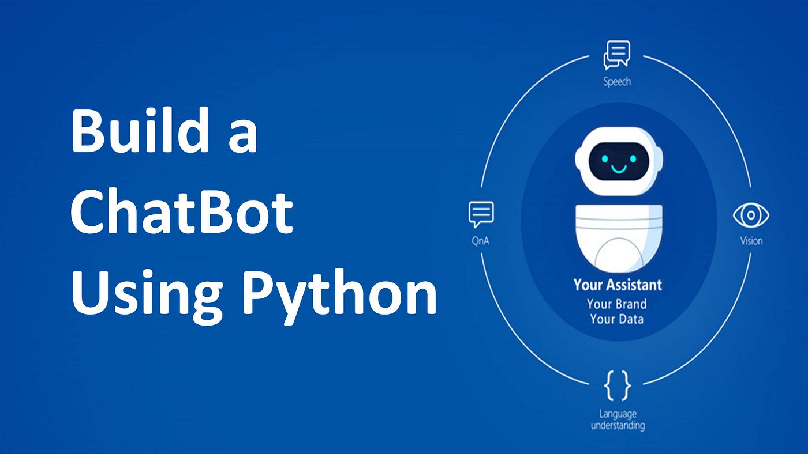

# ChatBot_Tensorflow_NLP
Artificial Intelligent ChatBot using Tensorflow and NLP that understand the Context and Intent of Human Language.

This repository contains a Python-based chatbot that leverages Natural Language Processing (NLP) and TensorFlow to understand and respond to user inputs. The chatbot can interpret the context and intent behind human language, making it capable of providing intelligent and context-aware responses.

## How the Chatbot Works

1. **Intent Recognition**:
   - The chatbot processes user inputs to determine their intent. It uses a JSON file (`intents.json`) that includes various predefined categories or intents, each associated with potential user inputs and corresponding responses.
   - Examples of intents include greetings, inquiries about the weather, or questions about services.

2. **NLP and TensorFlow**:
   - The core functionality of the chatbot is built using TensorFlow and a variety of NLP techniques.
   - The chatbot begins by tokenizing the user input, converting text into numerical data that the model can process.
   - A neural network is then trained on the dataset defined in `intents.json`, allowing the chatbot to classify user inputs into the appropriate intent categories.

3. **Response Generation**:
   - After identifying the user's intent, the chatbot selects a suitable response from the predefined options in the `intents.json` file.
   - This method ensures the chatbot provides relevant and contextually appropriate replies.

4. **Interactive Notebook**:
   - Included in the repository is a Jupyter Notebook (`chatbot using NLP and TensorFlow.ipynb`) that demonstrates the step-by-step process of building and training the chatbot.
   - This notebook is particularly useful for users who want to understand the underlying machine learning process or customize the chatbot for their needs.

## Repository Structure

- **`intents.json`**: This file contains the intents, sample user inputs, and possible responses. It serves as the core dataset for training the chatbot.
- **`chatterbot.py`**: This Python script handles the logic for processing user inputs and generating responses based on the trained model.
- **`chatbot using NLP and TensorFlow.ipynb`**: An interactive notebook that guides users through the training and implementation process of the chatbot using TensorFlow.
- **`botpic1.jpg`**: An illustrative image related to the project.

## Getting Started

To set up and run the chatbot:

1. **Clone the Repository**:
git clone https://github.com/JONY192/chatbot.git
cd chatbot

2. **Install Dependencies**:
Make sure Python is installed on your system. Use `pip` to install the required libraries:
pip install tensorflow numpy nltk

3. **Run the Chatbot**:
Execute the `chatterbot.py` script to start the chatbot:
python chatterbot.py

4. **Explore the Notebook**:
Open the Jupyter Notebook to see detailed instructions and code for building and training the chatbot:
jupyter notebook "chatbot using NLP and TensorFlow.ipynb"

## Contribution and Usage

We welcome contributions! Whether you’re interested in enhancing the model, adding new intents, or improving the interface, feel free to fork the repository and submit a pull request.

## License

This project is licensed under the MIT License. See the [LICENSE](LICENSE) file for details.

---

For more details, visit the [JONY192/chatbot repository](https://github.com/JONY192/chatbot) on

